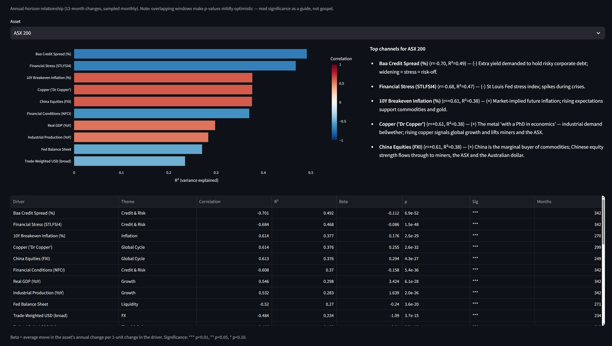
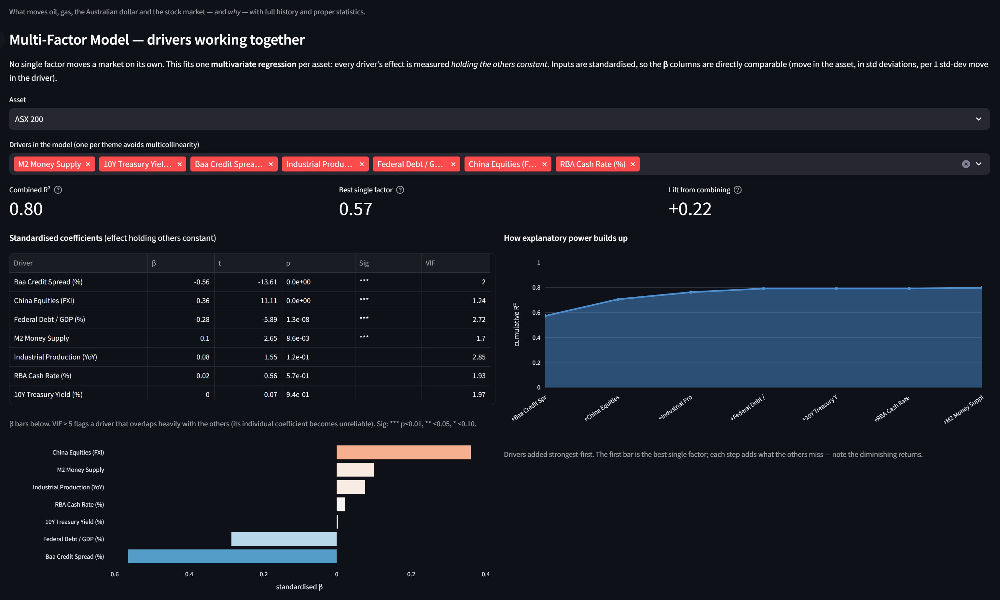

# What Moves Australian Markets — A Data Deep-Dive

A factor analysis of the **ASX 200** and the **Australian dollar**, drawn from
this repository's cross-asset dataset (1997–present). All relationships are
measured on **annual-horizon changes** (12-month, sampled monthly) using the
correct transform per series — returns for prices, year-over-year for nominal
levels (M2, CPI), first differences for rates/spreads. Correlations use
pairwise-complete observations.

> **One-line answer:** The ASX 200 is, at its core, a leveraged play on **global
> risk appetite** and the **China/commodity cycle**. Domestic monetary policy
> (the RBA cash rate) has almost no independent effect on the *index*. The
> Australian dollar is roughly half a US-dollar story and half a commodity-cycle
> bet.

---

## 1. What drives the ASX 200 (single factors)

| Driver | Correlation | R² |
|---|---:|---:|
| Baa credit spread | −0.70 | 0.49 |
| Financial stress (St Louis Fed) | −0.68 | 0.47 |
| 10Y breakeven inflation | +0.61 | 0.38 |
| **Copper** | +0.61 | 0.38 |
| **China equities (FXI)** | +0.61 | 0.38 |
| Financial conditions (NFCI) | −0.61 | 0.37 |
| Fed balance sheet | −0.52 | 0.27 |
| Trade-weighted USD | −0.48 | 0.23 |
| Industrial production | +0.48 | 0.23 |

Two clusters dominate: **global risk appetite** (credit spreads, financial
stress and conditions — all negative) and the **global industrial/commodity
cycle** (copper, China, industrial production — all positive). A strong US dollar
is a headwind.

## 2. The multi-factor verdict (effects held constant)

A multivariate regression — each effect measured *holding the others constant*,
standardised so betas are comparable — explains **67%** of the ASX's annual moves
versus **51%** for the best single factor (credit spreads):

| Driver | Std β | p | VIF |
|---|---:|---:|---:|
| Baa credit spread | −0.53 | <0.001 | 2.1 |
| **Copper** | +0.43 | <0.001 | 5.4 |
| Australian 10Y yield | −0.31 | <0.001 | 1.9 |
| Industrial production | +0.20 | 0.002 | 1.6 |
| M2 money supply | −0.17 | 0.037 | 2.6 |
| Trade-weighted USD | +0.16 | 0.038 | 2.3 |
| **RBA cash rate** | −0.03 | **0.71** | 2.5 |
| **China equities** | +0.00 | **0.97** | 1.7 |

### Three findings that matter for Australia

**1. The ASX is not "made in Australia."** Once global risk and the commodity
cycle are in the model, the **RBA cash rate has no independent explanatory power**
(p = 0.71). The only domestic survivor is the Australian 10Y bond yield
(β = −0.31) — and that is really the *valuation/discount-rate* channel, which
itself tracks global yields. Australian equity returns are not primarily set by
the RBA.

**2. Two genuinely independent engines.** After removing overlap, what stands is
**global risk appetite** (credit spreads, β = −0.53) and the **commodity cycle**
(copper, β = +0.43). They are distinct: risk-off can hit the ASX even when metals
are firm, and a China-driven metals slump can hit it even in calm credit markets.

**3. Copper and China are the same trade.** China's standalone correlation is
+0.61, but its *unique* contribution collapses to zero (p = 0.97) once copper is
present (copper's VIF of 5.4 flags the overlap). Think "copper/China" as one
global-industrial-demand factor — don't double-count it.

## 3. Iron ore — added, but a weak driver of the *index*

Iron ore is Australia's #1 export, so it belongs in the dataset (added via the
IMF series on FRED). But the data is clear that it does **not** drive the ASX 200
index, and is **not** simply copper in disguise:

| Global-demand driver | Correlation w/ ASX | R² |
|---|---:|---:|
| Copper | +0.61 | 0.38 |
| China equities | +0.61 | 0.38 |
| China exports | +0.32 | 0.10 |
| **Iron ore** | **+0.16** | **0.03** |

Iron ore correlates only **+0.41** with copper (so genuinely distinct), yet adds
**nothing** to the multi-factor model (β ≈ −0.02, p = 0.74). Why this is correct,
not a glitch:

- **The ASX 200 is bank-heavy and broad** (~30% financials, ~20% materials) — not
  a pure miner index.
- **Copper is a global-*risk* barometer**, co-moving with world equities, so it
  touches the whole index; iron ore is narrow.
- **Iron ore is supply- and policy-driven** (China steel curbs, property cycles,
  Brazil/Vale supply, port stockpiles) — idiosyncratic noise that makes it a poor
  *macro* signal even though it dominates BHP/RIO/FMG earnings and national income.

**Takeaway:** iron ore matters for Australia's *national income and miner
earnings*; copper matters for the *ASX index*. A secondary lesson — the
market-priced China proxies (copper, FXI) beat the physical-trade proxies (iron
ore, China exports), because markets price global risk appetite cleanly while
physical data lags and is policy-distorted.

## 4. What moves the Australian dollar

Using AUD/USD (full history; the RBA's daily trade-weighted index is too short
for this horizon), the multi-factor model explains **84%** of annual moves:

- **Half of it is the US dollar itself** (β = +0.62 on the broad USD). Much of
  "AUD weakness" is really USD strength, not anything Australian.
- **The other half is the commodity-currency story** — the AUD strengthens with
  inflation expectations, copper and China, confirming it as a leveraged bet on
  global growth and risk appetite.
- **The RBA carry effect is real but small** — the cash rate enters with the
  right sign (higher RBA rate → stronger AUD via rate differentials) and is
  statistically significant, but tiny next to the global forces. Rate-differential
  trades matter at the margin; global risk dominates.

## 5. Decomposing the two engines

**Global risk appetite is one latent factor.** The four gauges move together
(credit spread, financial conditions, financial stress, VIX all inter-correlate
0.47–0.87; conditions and stress are 0.87). Upstream, risk appetite is a
**growth + US-monetary** story: the Baa spread correlates −0.49 with the 10Y
yield and −0.36 with the Fed funds rate — spreads are *tightest* (risk-on) when
growth is strong and yields rising. (The +0.37 link to the Fed balance sheet is
reverse causality — the Fed expands it *during* crises.) The chain for Australia:
**global growth + US monetary conditions → risk appetite → ASX.**

**Global industrial demand = China, read through markets.** Copper and China
equities (both +0.61) beat China exports (+0.32) and iron ore (+0.16). Copper
already absorbs China's signal, so the cleanest single indicator of the
China/industrial-demand engine for the ASX is **copper**, with **China equities
(FXI)** as the sentiment companion.

## 6. Timing and stability (two cautions)

- **No reliable lead.** At the monthly/annual horizon, the major drivers move
  *with* the ASX (peak cross-correlation at lag 0), not ahead of it. The ASX is a
  real-time price-taker on global conditions, not something a slow macro signal
  front-runs.
- **Daily numbers mislead for the ASX.** The ASX closes hours *before* Wall
  Street, so same-calendar-day correlation with the S&P 500 looks low (~0.18);
  at the monthly horizon, where the timezone washes out, it jumps to **+0.71**.
  Judge Australia's global linkage at horizons that matter (months), not day-to-day.

## 7. Practical takeaways

- The ASX 200 is a **leveraged bet on global risk appetite and the China/commodity
  cycle** — ~two-thirds of annual moves from credit spreads + copper + global growth.
- **The RBA matters more for the currency (carry) than for equities.**
- The **AUD is "USD strength + a commodity bet."**
- **Copper is the single best Australian dashboard indicator** — it independently
  survives every model, proxies China, and links the equity market and the
  currency together.

---

### Method & caveats

Annual-horizon relationships use overlapping 12-month windows sampled monthly,
which mildly understates p-values (autocorrelation) — treat significance as a
guide. Copper/China collinearity means their individual coefficients should be
read as one combined "global cycle" effect. Reproduce any figure here from the
dashboard (`streamlit run app.py`) or the saved tables in `data/`.
