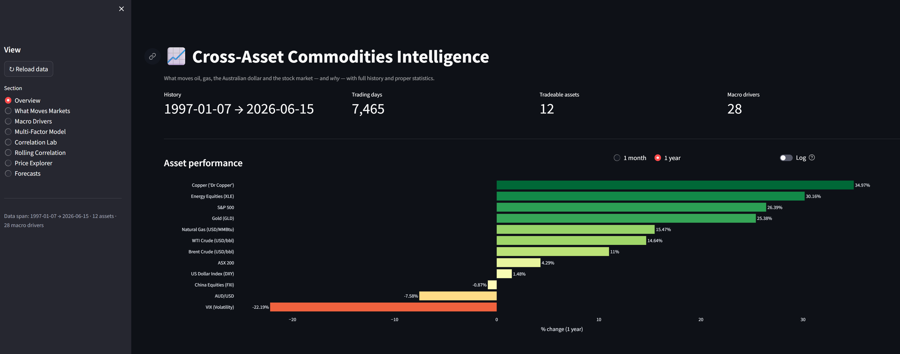
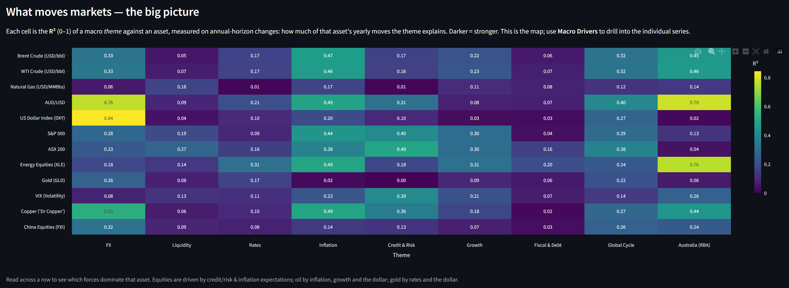
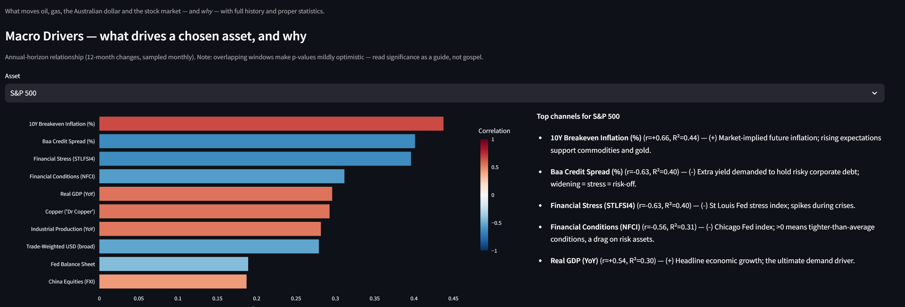
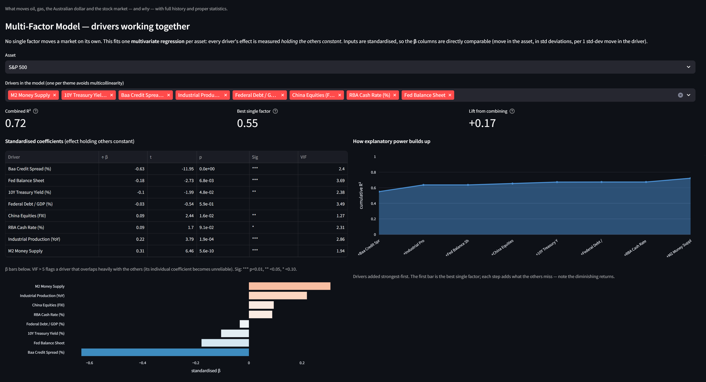
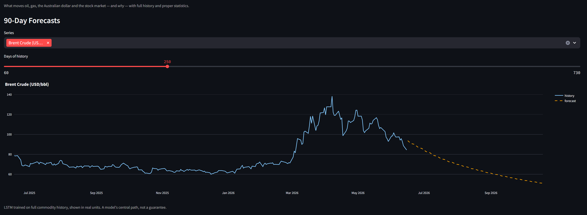

# Cross-Asset Commodities Intelligence 📈

Quantifies what moves oil, gas, the Australian dollar and the stock market, and why, across roughly 30 years of history, with the statistics to back every claim: correlation, R², rolling correlation, single- and multi-factor regression, and a 90-day forecast. Built on three commodity pipelines (`oil-prices`, `natural-gas`, `exchange-rates`) enriched with live macro data from **FRED**, market data from **Yahoo Finance**, and Australian data from the **RBA**.

An interactive Streamlit dashboard turns it into something you can explore; a Flask API exposes the same numbers programmatically.



## Headline findings

A few results that fall out of the data (annual-horizon, full history):

- **Markets are multi-factor.** No single driver explains an asset. Gold goes from 26% explained by its best single factor to **56%** once factors are combined; the S&P 500 from 51% to **71%**. Some "drivers" that look strong alone lose significance once you control for the rest.
- **Global risk appetite is one latent force.** Credit spreads, financial conditions, stress and the VIX all move together, and the underlying story is fundamentally about growth and US monetary policy.
- **Gold is a real-rates-and-dollar asset.** Its two biggest drivers are the 10Y real yield and the US dollar (both negatively correlated), exactly as theory predicts.
- **Natural gas is the lone idiosyncratic commodity.** Near-zero correlation with everything, driven by weather and storage rather than global macro.
- **The ASX 200 is not "made in Australia."** It is a leveraged bet on global risk appetite and the China/commodity cycle. The **RBA cash rate has no independent effect on the index** once global factors are accounted for. See the full write-up in **[ANALYSIS_AUSTRALIA.md](ANALYSIS_AUSTRALIA.md)**.
- **Copper beats iron ore for the ASX.** Despite iron ore being Australia's largest export, copper drives the *index* because it acts as a global-risk barometer. Iron ore drives national income and miner earnings, not the broad index.

## What it does

- **Correlation and R² matrices** across tradeable assets, calculated on returns (the statistically sound basis) with price-levels shown alongside for contrast.
- **Macro driver analysis:** roughly 30 macro drivers grouped into themes, each related to every asset at the horizon that matters, with the transmission mechanism spelled out (why it moves markets, and in which direction).
- **Multi-factor models:** a multivariate regression per asset. Each effect is measured holding the others constant, with standardised betas, significance, VIF multicollinearity checks, and an incremental-R² build-up.
- **Rolling correlation:** how relationships strengthen or break down over time.
- **90-day LSTM forecast** for the four core commodity and FX series, in real units, benchmarked against naive baselines.

## Methodology (why returns, not prices)

Correlating raw **price levels** is misleading. Two series that both trended up over years look correlated even if unrelated (this is known as spurious correlation). The sound approach is to correlate **changes**, using the right transformation per series:

- price-like series: percentage **returns**
- nominal levels (M2, CPI, debt, GDP): **year-over-year** change
- rates, spreads and ratios: **first differences** (a percentage change of something that can cross zero is meaningless)

Fast tradeable assets are analysed daily; slow macro drivers are resampled to month-end and compared at an **annual horizon**, which is the timescale at which macro relationships actually show up. Statistics use pairwise-complete observations, so assets with shorter history (e.g. Gold ETF from 2004) still contribute where data overlaps.

## Data: asset universe

**Tradeable assets** (daily, analysed on returns):

| Group        | Series                                          | Source        |
|--------------|-------------------------------------------------|---------------|
| Commodities  | Brent, WTI, Natural Gas                          | local repos   |
| FX           | AUD/USD, US Dollar Index (DXY)                   | repos / Yahoo |
| Equities     | S&P 500, ASX 200, Energy sector (XLE)           | Yahoo Finance |
| Safe haven   | Gold (GLD)                                       | Yahoo Finance |
| Risk         | VIX (volatility)                                | Yahoo Finance |
| Global cycle | Copper, China equities (FXI)                    | Yahoo Finance |

**Macro drivers** (analysed at annual horizon):

| Theme           | Series                                                          |
|-----------------|----------------------------------------------------------------|
| Liquidity       | M2, Fed balance sheet, reverse-repo                            |
| Rates           | Fed funds, 2Y and 10Y Treasury, 10Y real yield, 10Y-2Y curve  |
| Inflation       | CPI, core PCE, 10Y breakeven inflation                        |
| Credit and Risk | Baa credit spread, Chicago Fed and St Louis financial conditions |
| Growth          | Industrial production, jobless claims, real GDP, unemployment   |
| Fiscal and Debt | Federal debt, debt-to-GDP, household debt-service ratio         |
| Dollar          | Trade-weighted USD (broad)                                      |
| Global cycle    | Iron ore (IMF), China exports                                  |
| Australia (RBA) | Cash rate, 10Y AGB yield, year-ended CPI, AUD trade-weighted   |

Sources: **FRED** (macro and IMF commodity prices), **Yahoo Finance** (equities, gold, copper, VIX, real DXY), and the **RBA's free CSV tables** for Australian series. History spans **1997 to present (roughly 7,500 trading days)**.

## Quick start

```bash
pip install -r requirements.txt   # needs yfinance >= 1.2.0
python refresh.py                 # fetch data, fit model, compute all statistics
streamlit run app.py              # launch dashboard (http://localhost:8501)
```

The macro series use a working FRED demo key by default; set your own with
`export FRED_API_KEY="..."` (free at fred.stlouisfed.org).

## Dashboard

Eight focused views. A few highlights:

**What Moves Markets:** an asset × macro-theme R² map showing the big picture at a glance.



**Macro Drivers:** drill into any asset to see ranked drivers with the transmission mechanism, beta and significance.



**Multi-Factor Model:** drivers working together, showing standardised beta, VIF, and how explanatory power builds up versus the best single factor.



**90-Day Forecasts:** an LSTM forecast plotted as a continuation of recent history.



| Section             | What you get                                                    |
|---------------------|----------------------------------------------------------------|
| Overview            | KPIs, an asset performance chart (1mo/1yr), and per-asset cards |
| What Moves Markets   | Asset × macro-theme R² map                                     |
| Macro Drivers        | Drill into any asset: ranked drivers, beta, significance, why  |
| Multi-Factor Model   | Drivers together: standardised beta, VIF, combined vs single R² |
| Correlation Lab      | Daily correlation and R² heatmaps for tradeable assets         |
| Rolling Correlation  | Time-varying correlation between any two assets                 |
| Price Explorer       | Full-history charts, rebase-to-100, log scale, adjustable window |
| Forecasts            | 90-day forecast plotted as a continuation of recent history     |

## Architecture

```
commodities-intelligence/
├── src/
│   ├── catalog.py           # Single source of truth: every series + metadata
│   ├── fetch.py             # Load Brent/WTI/gas/FX from local repos
│   ├── external_sources.py  # FRED macro series
│   ├── market_data.py       # Equities/gold/copper/VIX/DXY via yfinance
│   ├── rba.py               # RBA statistical tables (Australia)
│   ├── preprocess.py        # merge_asof alignment + LSTM sequencing
│   ├── stats_analysis.py    # Correlation, R², rolling, single/multi regression
│   ├── forecast.py          # LSTM model
│   └── analysis.py          # Baselines, backtest helpers
├── app.py                   # Streamlit dashboard
├── api.py                   # Flask REST API
├── refresh.py               # Orchestration: data -> forecast -> stats
├── ANALYSIS_AUSTRALIA.md    # Deep-dive: what moves Australian markets
└── requirements.txt
```

`src/catalog.py` is the design centre. Every series (whether a tradeable asset or macro driver) declares its source, frequency, the correct statistical transform, and its transmission mechanism. Add one entry there and it flows through fetching, analysis and the entire dashboard automatically.

`refresh.py` writes tidy CSVs to `data/` (`merged_data`, `corr_returns`, `r2_returns`, `macro_relationships`, `multifactor_coefficients`, `multifactor_summary`, `forecasts`, `baselines`, `metrics`).

## Forecasting model

A multi-output **LSTM** (64 to 32 units, dropout) trained on the full commodity history: a 60-day window predicts the next day, rolled forward 90 days and inverse-scaled to real units. Naive baselines (moving average, random walk) make the model's value-add measurable rather than assumed.

**Limitations:** the model assumes the future resembles the past and does not anticipate structural breaks such as geopolitical shocks or policy regime changes. Treat forecasts as a central path, not a guarantee.

## Disclaimer

Educational and research tool. **Not financial advice.** Commodity prices and exchange rates are volatile and forecasts carry significant uncertainty. Use alongside fundamental analysis and professional advice.

## License

MIT
